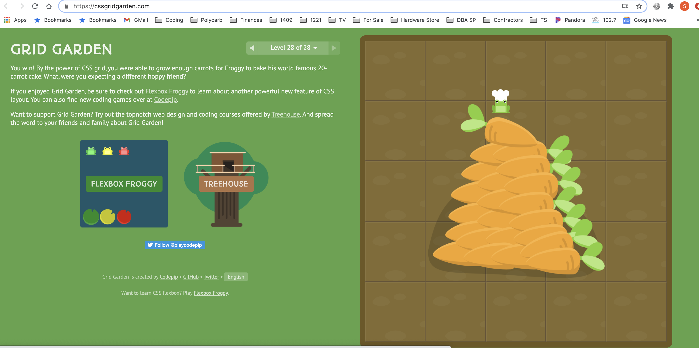

# Code 301: Class 04 - Reading Name

***

## Read: [CSS Grid Garden](https://cssgridgarden.com/)

- Completed the Grid Garden Tutorial which was entertaining and informative

## Bookmark / Skim: [RegExr](https://regexr.com/)

## Bookmark / Skim: [Regex Tutorial](https://medium.com/factory-mind/regex-tutorial-a-simple-cheatsheet-by-examples-649dc1c3f285)

## Bookmark / Skim: [Regex 101](https://regex101.com/)

- Regex 101 is a browser based sandbox tool for experimenting with regular expressions

## Bookmark / Skim: [CSS Grid Reference](https://css-tricks.com/snippets/css/complete-guide-grid/)

## Bookmark / Skim: [Responsive design with CSS Grid](https://medium.com/samsung-internet-dev/common-responsive-layouts-with-css-grid-and-some-without-245a862f48df)

***

[Return to reading-notes Deployed Site](https://simon-panek.github.io/reading-notes/)

[Return to reading-notes Mark Down](https://github.com/simon-panek/reading-notes)
