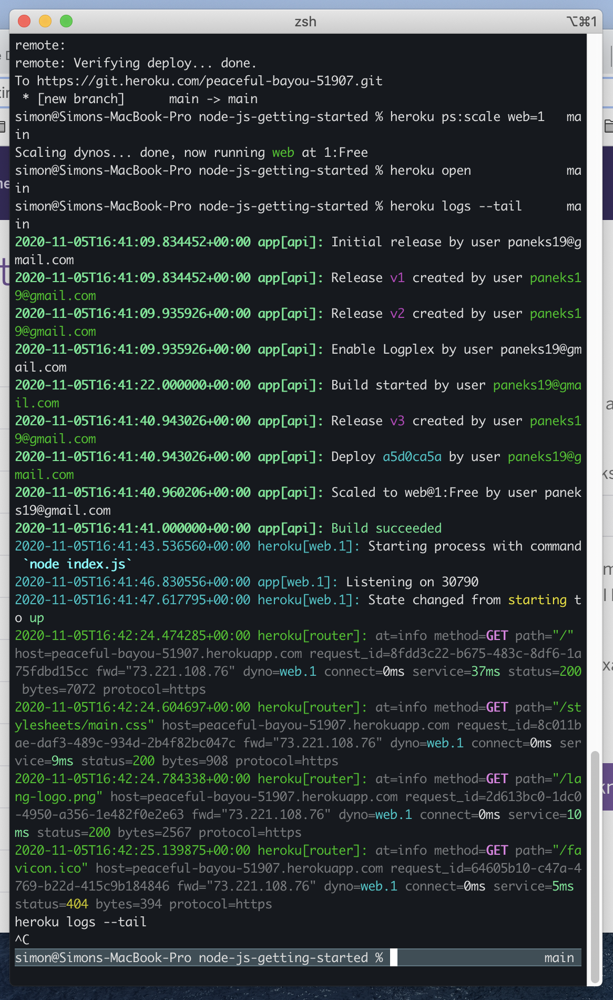

# Code 301: Class 05 - Heroku 

***

## Read: [Heroku: Getting Started with Node](https://devcenter.heroku.com/articles/getting-started-with-nodejs)

- Completed all tutorial steps through "View Logs"
- Screen shot of terminal after viewing logs

## Skim: [Deploying a Simple Blog to Heroku](https://howtonode.org/deploy-blog-to-heroku)

***

[Return to reading-notes Deployed Site](https://simon-panek.github.io/reading-notes/)

[Return to reading-notes Mark Down](https://github.com/simon-panek/reading-notes)
