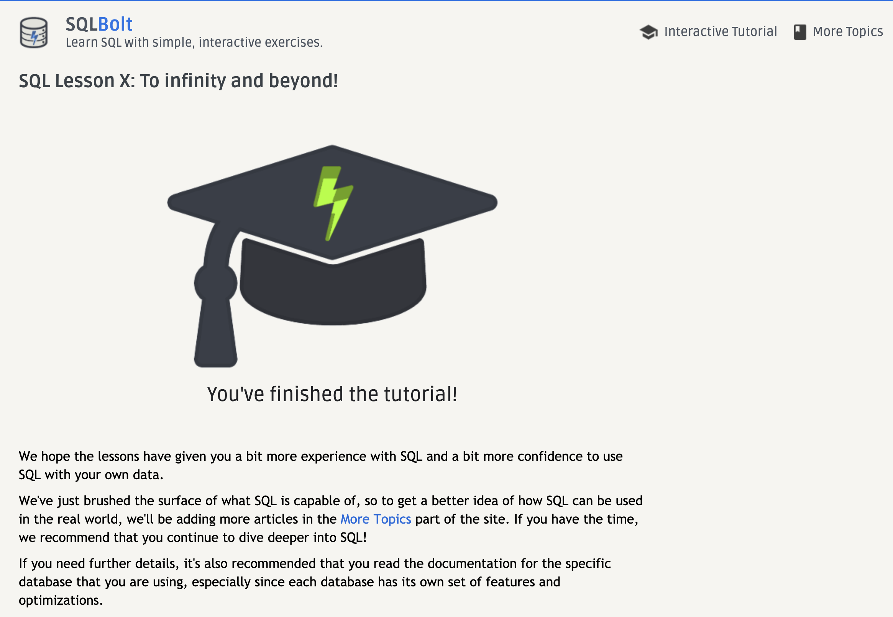

# Code 301: Class 08 - SQL

***

## Read: [SQL Bolt Tutorial](https://sqlbolt.com/)

- Completed sections 1-4 and 13-18 of this interactive tutorial. This tutorial was more difficult than past tutorials and operated less smoothly. A number of times I entered would should have been a correct answer only to find out that the system wanted a different answer that did the same thing.

## Practice: [SQL on W3 Schools](https://www.w3schools.com/sql/trysql.asp?filename=trysql_select_all)

- This is an interactive browser tool that allows the user to test different SQL queries

## Additional Resources: [Primer on SQL](https://openlibra.com/en/book/download/a-primer-on-sql-3rd-edition)

- SQL *Structured Query Language*
  - DDL *Data Definition Language* `CREATE TABLE`, `ALTER TABLE`, `DELETE`
  - DQL *Data Query Language* `SELECT`
  - DCL *Data Control Language* `GRANT`, `REVOKE`
  - Transaction Control Commands `COMMIT`, `ROLLBACK`
- Common Data Types
  - `varchar` *Variable number of characters*
  - `char` *Fixed length characters*
  - `int` *Integer Values*
  - `decimal` *Decimal Numbers8
  - `date` *Date data type*
- Terminal Command
  - `createdb` *Creates a new database in your current directory, similar to creating any other file using `touch`
  - `.open database-filename` *To open the new database
- General Syntax of a simple SQL query
  - `SELECT selection FROM table_name;` 
- Deleting a table
  - `DROP TABLE table_name;`
- Creating a New Table from an Existing Table
  - `CREATE TABLE new_table_name AS SELECT selection FROM old_table_name;`
- Ordering Results
  - `SELECT select_columns FROM table_name ORDER BY column_name;`
- Using a Where Conditional
  - `SELECT select_columns FROM table_name WHERE condition;`

## Additional Resource: [SQL Cheat Sheet](http://www.cheat-sheets.org/sites/sql.su/)

- This is a printable browser based cheat sheet offering many of the standard SQL query structures

***

[Return to reading-notes Deployed Site](https://simon-panek.github.io/reading-notes/)

[Return to reading-notes Mark Down](https://github.com/simon-panek/reading-notes)
